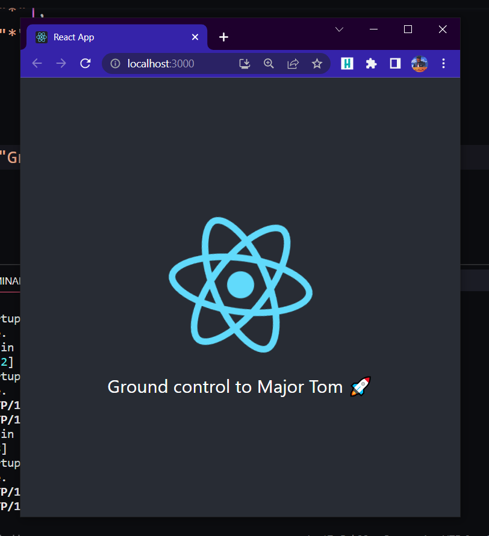

# FastReact
A fast, reliable and minimal template for FastAPI backend and React.js frontend.

## Table of Contents
- [Requirements](#requirements)
- [Installation](#installation)
- [Usage](#usage)
- [TODO](#todo)
- [License](#license)


## Requirements
To start of with, make sure you have `python 3.10` or above and node `v18.16.0` installed.

Run the following:
```bash
pip install -r requirements.txt
```

## Usage
Run the following command:

```bash
.\commands.bat
```

This should open a React app instance on `localhost:3000` that displays the message from the FastAPI backend.

FastAPI GET http route:

```python
@app.get("/")
def root():
    return {"msg": "Ground control to Major Tom 🚀"}
```

React Frontend:
<p align="left"><br></p>

Further, you can edit the `main.py` and the `/frontend/component/Message.js` according to your use case and use the template to its fullest.

## TODO
- [ ] Add Database support